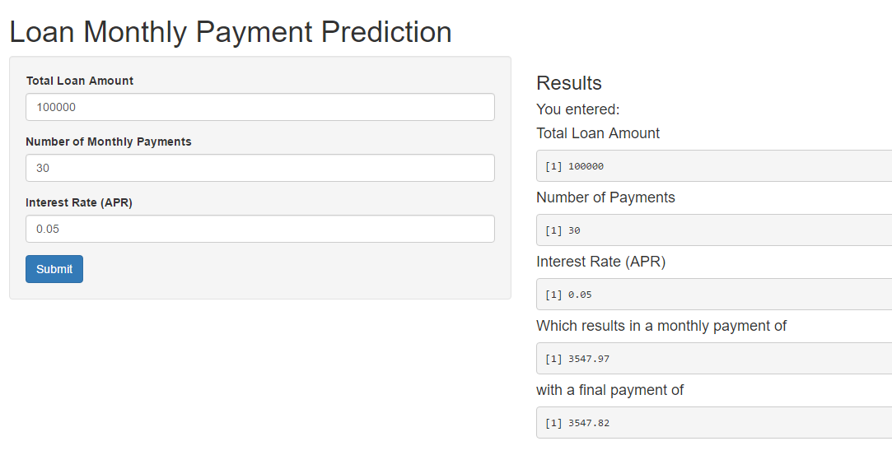

<body style="background-color:#006600;">
<h1>
<ins>Below are the formulas:</ins>
</h1>
<h3>Monthly Payment (rounded to nearest cent):</h3>
<p>$$\frac{T i}{1 - (1 + i)^{-n}}$$</p>
<p style="color:green;">
  Where: <br>
    T = Total Loan Payment <br>
    i = Effective Interest Rate (input is interest rate per YEAR while effective interest rate is per MONTH)<br>
    n = Number of Payments
    </p>
</body>

---   

<body style="background-color:#006600;">
<h3 style = "color:green;">Final Payment (rounded to nearest cent):</h3>
<p>$$E = \frac{Q(1-(1+i)^{-n})}{i} - T$$
    $$Q - E(1+i)^n$$
</p>
<p style = "color:green;">
  Where: <br>
    Q = Monthly Payment <br>
    T = Total Loan Payment <br>
    i = Effective Interest Rate (input is interest rate per YEAR while effective interest rate is per MONTH) <br>
    n = Number of Payments
    </p>
</body>

---

<body style="background-color:#006600;">

</body>

---

```{r, out.width = '750px', dpi=200, fig.align='center', echo=FALSE}
  Q = 3547.97
  R = 3547.82
  Payments <- as.vector(rep(29,0))
  for (i in 1:29){
    Payments[i] <- Q*i
  }

Payments[30] <- (Q*29)+R

PmtNum <- (1:30)
LoanApp <- as.data.frame(cbind(PmtNum,Payments))
names(LoanApp) <- c("Payment", "TotalPaid")

barplot(LoanApp$Payment, LoanApp$TotalPaid, col = "purple")
title(main="Aggregated amount paid throughout life of loan - with default data", ylab = "Number of Payments Made")
text(150000,29, col="navy",lwd = 6, labels="Total Paid")
text(150000,27, col="navy",lwd = 6, labels="$      ,             ")
text(150000,27, col="navy",lwd = 6, labels=Payments[30])
  
```   


