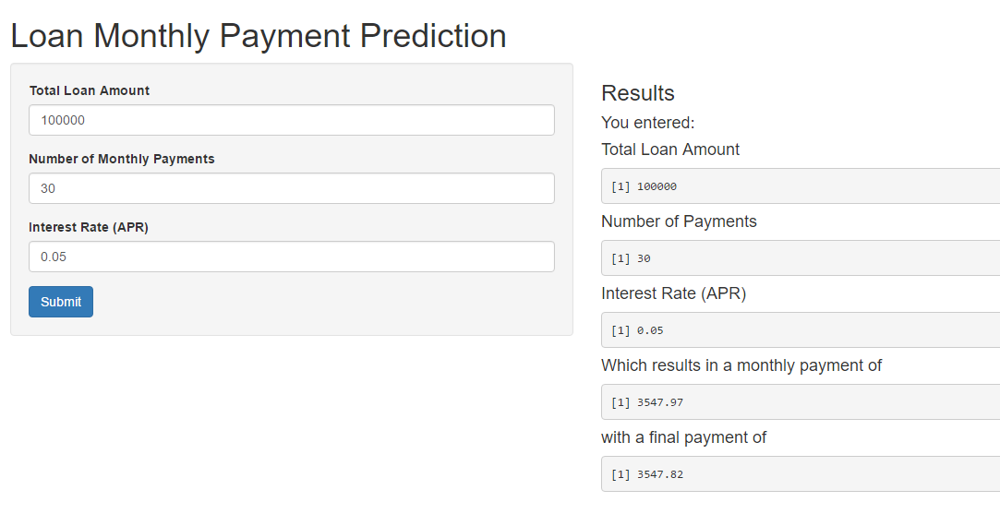

<body style="background-color:#006600;">
<h1>
<ins>Below are the formulas:</ins>
</h1>
<h3>Monthly Payment (rounded to nearest cent):</h3>

$$\frac{T i}{1 - (1 + i)^{-n}}$$

  Where:  
    T = Total Loan Payment  
    i = Effective Interest Rate (input is interest rate per YEAR while effective interest rate is per MONTH) 
    n = Number of Payments
    

</body>

---   

<body style="background-color:#006600;">
<h3 style = "color:green;">Final Payment (rounded to nearest cent):</h3>

$$E = \frac{Q(1-(1+i)^{-n})}{i} - T$$
    $$Q - E(1+i)^n$$

  Where:  
    Q = Monthly Payment  
    T = Total Loan Payment  
    i = Effective Interest Rate (input is interest rate per YEAR while effective interest rate is per MONTH)  
    n = Number of Payments
    

</body>

---

<body style="background-color:#006600;">

</body>

---

